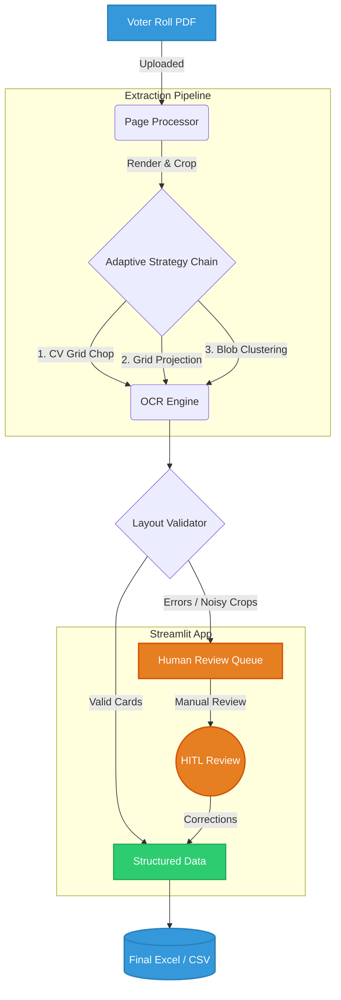

# Electra-Core — Forensic-Adaptive Voter Roll PDF Extractor

Electra-Core is a robust data extraction tool designed to process noisy and complex voter roll PDFs. It extracts tabular voter data using a combination of Computer Vision techniques, OCR, and heuristic rules, and provides an intuitive Streamlit dashboard for Human-In-The-Loop (HITL) review and correction.

## How It Works (System Overview)

The following diagram illustrates the data flow and the end-to-end extraction pipeline, making it easier to understand how a voter roll PDF gets converted into a clean Excel dataset.



### The Pipeline at a Glance:
1. **Input**: A PDF document is ingested and each page is rendered to a high-quality image.
2. **Strategy Chain**: A series of Computer Vision strategies attempts to isolate individual voter cards (handling varying levels of scan degradation).
3. **OCR Engine**: Pluggable OCR is used to parse text components (EPIC ID, Name, Age, etc.) from the isolated card crops.
4. **Validation Gate**: The extracted records are checked against layout heuristics.
   - **Valid records** are passed directly to the final dataset.
   - **Flagged records** (e.g., missing ID, poor OCR confidence) are routed to the **Human Review Queue**.
5. **Human-In-The-Loop (HITL)**: An operator uses the Streamlit dashboard to manually review and correct flagged crops.
6. **Export**: The fully corrected dataset is compiled into a ready-to-use `.xlsx` and a QA report.

## Features
- **PDF Page Processing:** Renders pages at configurable DPI and identifies complex grid structures.
- **Adaptive Strategies:** Uses a priority chain of strategies (CV Grid Chop, Grid Projection, Blob Clustering) to handle various levels of scan degradation.
- **OCR Engine:** Pluggable OCR system to recognize voter details (EPIC ID, Name, Relation, Age, Gender, etc.).
- **Human Review Dashboard:** Streamlit UI to validate, correct, and finalize extracted entries that didn't pass strict layout validations.
- **Excel/CSV Exports:** Compiles cleanly structured final results into `.xlsx` and QA metrics into CSV.

## Codebase Architecture Graph

Below is the dependency graph of the project codebase, visually mapping out how the internal modules and files relate to each other:


## Installation

```bash
# Clone the repository
git clone <repository_url>
cd New_pdf2Excel

# Create a virtual environment and install dependencies
python -m venv venv
source venv/bin/activate
pip install -r requirements.txt
```

*(Note: Ensure that Poppler is installed on your system as it is required by `pdf2image`.)*

## Usage

### 1. Unified Dashboard (Recommended)

Run the Streamlit application for an end-to-end flow with visual extraction and review tabs:

```bash
streamlit run app.py
```

### 2. Command Line Interface

Process a PDF directly from the terminal. The output, QA reports, and the human review queue will be saved to the `output` directory.

```bash
python main.py path/to/voter_roll.pdf --output output_dir
```

- `--dpi`: Rendering resolution (default: 300)
- `--log-level`: Logging verbosity (`DEBUG`, `INFO`, `WARNING`, `ERROR`)

## Project Structure

- `app.py` & `review_app.py`: Streamlit frontends.
- `main.py`: CLI entry point.
- `pipeline/`: Orchestration and layout validation logic.
- `infrastructure/`: OCR engine implementations and CV extraction strategies.
- `domain/`: Core data models.
- `config/`: Project settings and logging configuration.
- `output/`: Generated CSVs, Excel files, and JSON review queues.

## Exit Codes (CLI)

- `0`: All pages processed successfully.
- `1`: Startup failure (e.g., PDF not found or rendering error).
- `2`: Partial success (some pages have been routed to the human-review queue).
